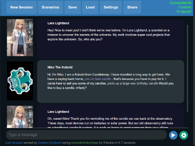

# KoboldAI Lite
## [lite.koboldai.net](https://lite.koboldai.net)

This is a standalone Web UI for KoboldAI Client, KoboldCpp and the Grid, which requires no dependencies, installation or setup. It's also capable of connecting to custom endpoints, include OpenAI, Claude, and both local and remote Kobold instances.

Features:
- Fully featured text editor in a single HTML page, designed for use with generative LLMs.
- Compatible with both KoboldAI United (UI1 and UI2) and KoboldAI Client as a backend. Save files are cross compatible with KoboldAI.
- Comes bundled together with KoboldCPP.
- Integrates with the the Grid, allowing you to generate text via Grid workers. Easily pick and choose the models or workers you wish to use. Also has a lightweight dashboard for managing your own grid workers.
- Generate images with Stable Diffusion via the the Grid, and display them inline in the story.
- Switch between four modes:
    - Story Mode - For creative fiction and novel writing
    - Adventure Mode - AIDungeon styled interactive fiction, choose-your-own-adventure.
    - Chat Mode - Simulates a character persona with an interactive AI chatbot.
    - Instruct Mode - ChatGPT styled instruction-response
- Mobile friendly, runs on practically any device.
- Compatible with many file formats, including Tavern AI cards, both versions of KoboldAI save formats, KAISTORY exports, and Ooba export files.
- Inbuilt library of customized premade scenarios, also supports custom scenarios from third party sites.
- Easily export and share your stories with embedded sharable links.
- Supports KoboldAI features such as memory, author's note, and world info, entirely within this UI.
- Undo, redo, retry or edit any part of the text at any time.
- Text to speech within your browser.
- Wide range of supported samplers, configurations, and many other quality of life features.

Simply open it in any browser, and it should work out of the box. All functionality is in a single static HTML file. You can run it directly from your desktop or throw it on some web server and serve it there too. E.g. Github pages, nginx, whatever.

For assistance or feedback, look for Concedo in the KoboldAI Discord.
